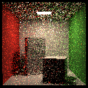
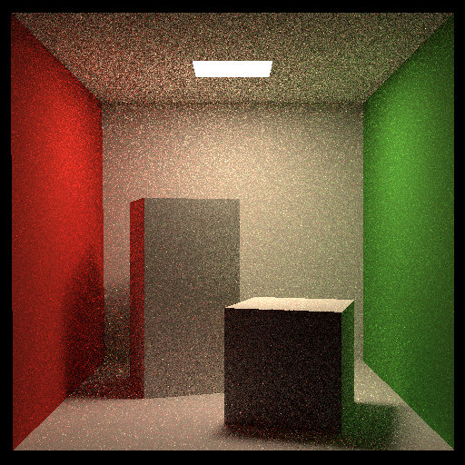

### 实验结果如下

#### 128*128分辨率 1spp图像

#### 512*512分辨率 16spp图像

### Hint
实验中自己感觉的注意点
1.所有的方向向量，都应该将其归一化，再做计算，否则绘制的图像为一片白图

2.计算直接光照时，L_dir=Lemit*(blabla)，这个Lemit是光源采样点的emit，否则会绘制全黑

3.如果对这个流程不够理解，应该反复看ray tracing的这几节课，同时可以参考《全局光照算法技术》，2，3，4，5章节，能够熟练的推导渲染方程。对于渲染方程的推导我认为有三部分，总结如下。

* 能够根据辐射度量学理论推导kajiya的默认形式的渲染方程
* 通过区域公式转换，推导出基于区域积分的渲染方程
* 通过引入蒙特卡洛、Russia RussianRoulette，推导出编程中实现的蒙特卡洛风格的渲染方程

